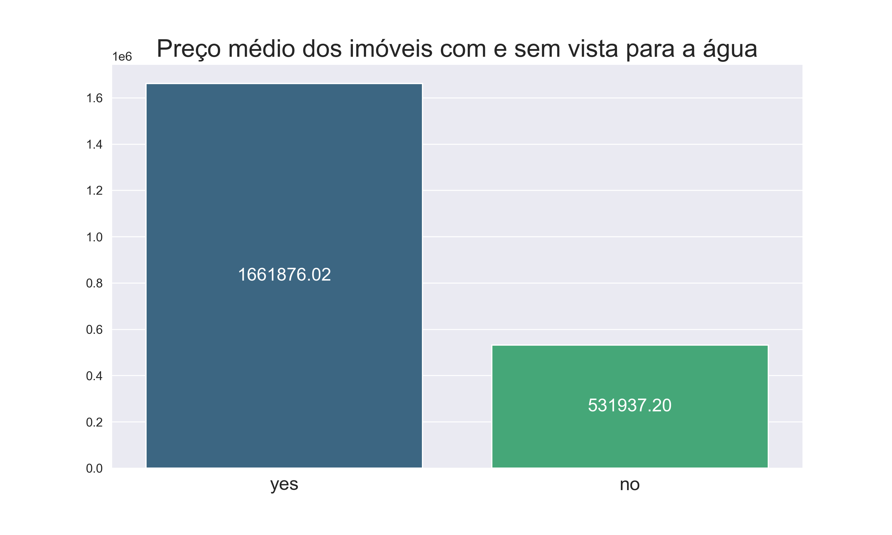
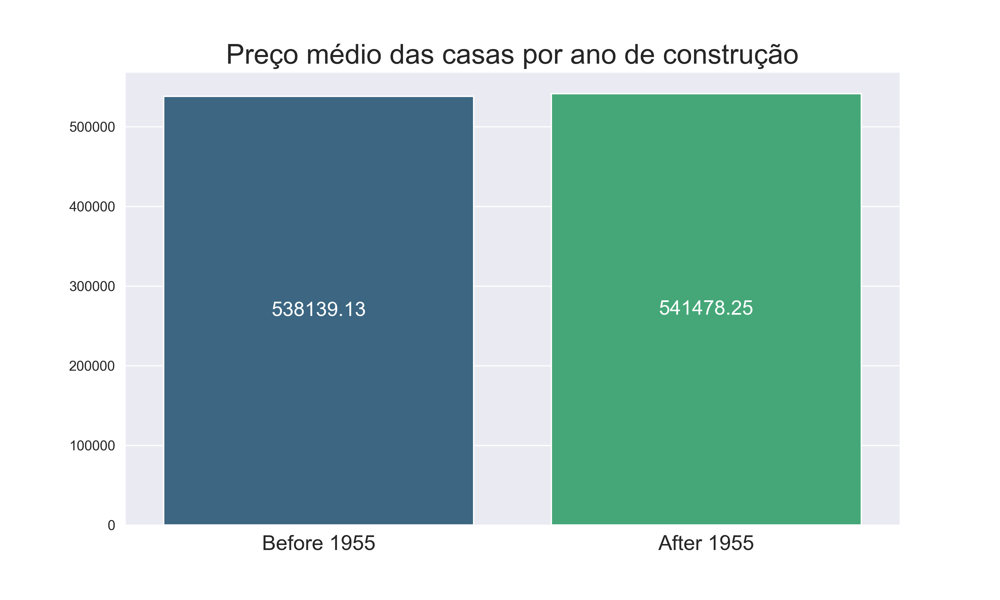
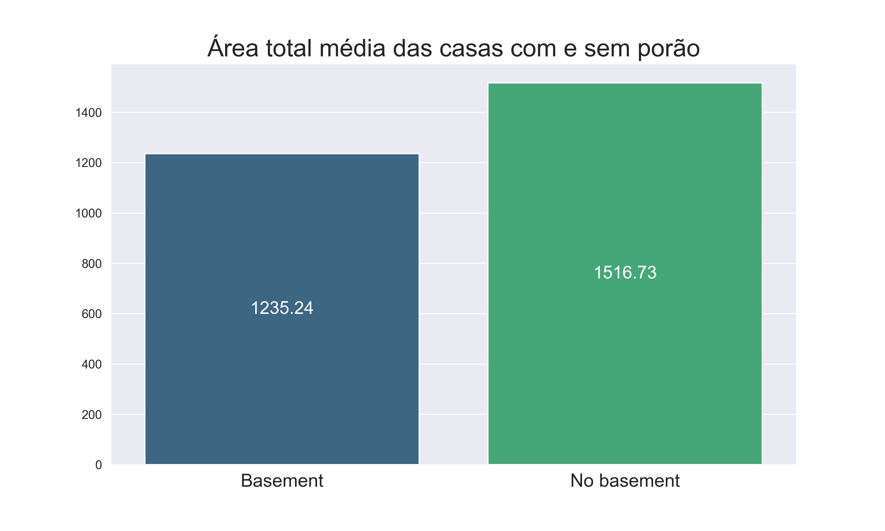
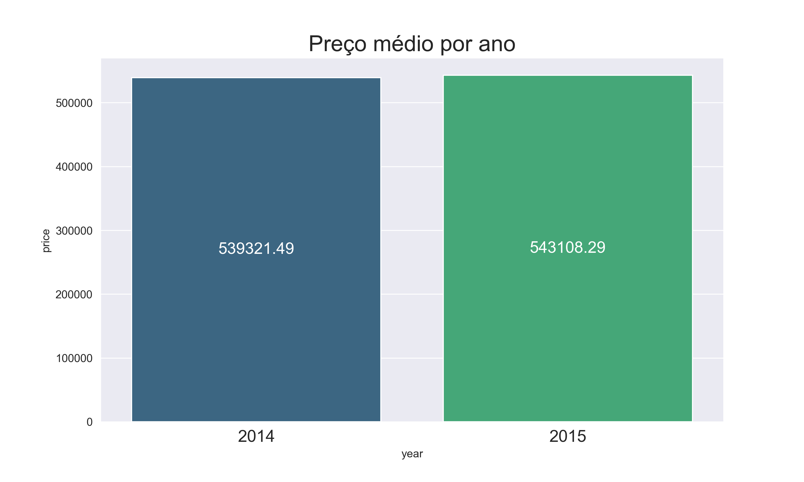
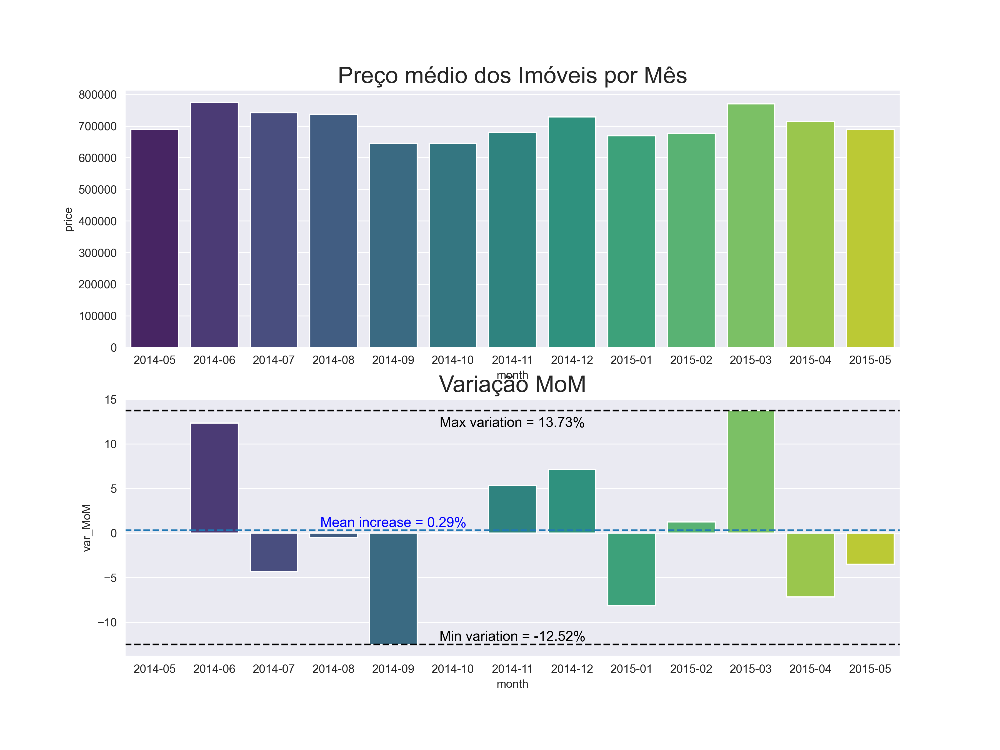
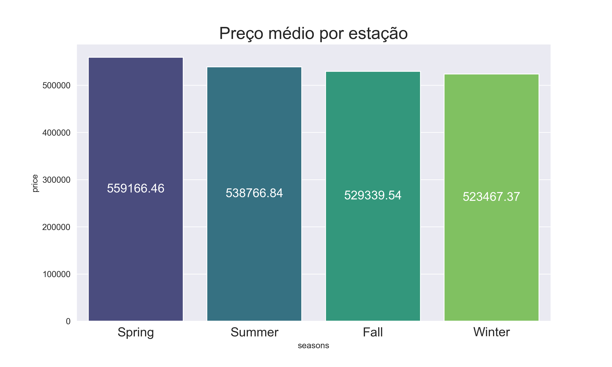
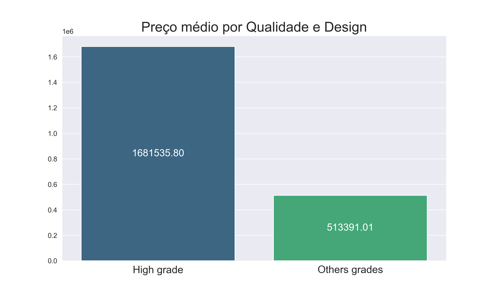
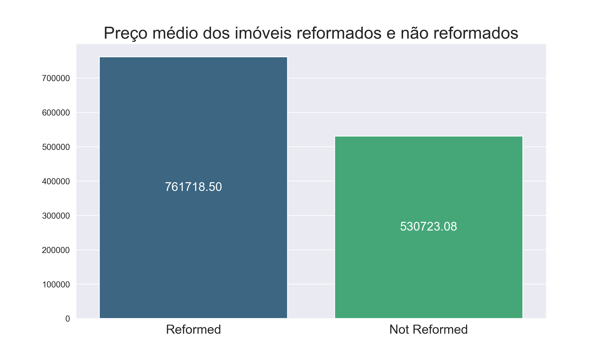
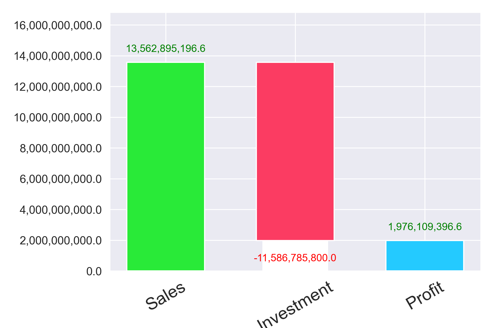

# Insights-Project-House-Rocket

# 1. Questões de negócio

1. Quais são os imóveis que a House Rocket deveria comprar e por qual preço?
2. Uma vez o imóvel comprado, qual o melhor momento para vendê-lo e por qual preço?

# 2. Premissas do Projeto

- Valores de "ID" duplicados foram excluídos.
- A coluna "price" representa o valor de compra do imóvel.
- O preço das casas é influenciado pela região (zipcode) e estação do ano (seasons)
- Imóveis considerados boas oportunidades de compra são aqueles que estão abaixo do preço médio da região e estão em bom estado
- Para a decisão do preço de venda são consideradas três features, o preço de compra, a região e a estação do ano
    - Se o preço de compra for menor que o preço médio da região na determinada estação, o preço de venda será 30% maior que o preço de compra
    - Se for maior, o acrescimo será de 10%

# 3. Planejamento da Solução

## 3.1 Produto Final

- Relatório com as sugestões de compra do imóvel por um valor recomendado
- Relatório com as sugestões de venda de um imóvel por um valor recomendado

## 3.2 Ferramentas

- Python 3.8.1
- Jupyter Notebook

## 3.3 Processo

### 3.3.1 Estratégia de solução

1. Entendimento do modelo de negócio da empresa
2. Entendimento do problema de negócio
3. Coleta dos Dados
4. Limpeza dos dados
5. Análise Exploratória dos Dados
6. Levantamento de hipóteses
7. Validação das hipóteses e Insights gerados

### 3.3.2 Etapas de solução

→ Recomendação de compra de imóveis

- Coletar os dados do site do kaggle
    - Agrupar os dados pela região (zipcode e estação)
    - Calcular a mediana do preço dos imóveis por região
    - Sugerir que os imóveis que estão abaixo do preço mediano de cada região e que estejam em boas condições sejam comprados
    - Salvar recomendações em .csv

→ Recomendação do preço de venda dos imóveis

- Agrupando dados por região e estação
- Combinando com o Dataframe original
- Adicionar features de ‘sell_price” de acordo com as premissas
- Adicionar feature ‘profit’
- Salvar em .csv

# 4. Exploração de dados

## 4.1 Teste de Hióteses

- H1: Imóvel que possuem vista para água são 30% mais caros na média
    
    *→ **Falso**, imóveis com vista para a água são em média **212% mais caros***
    

- H2: Imóveis com data de construção menor que 1955 são 50% mais baratos na média
    
    *→ **Falso**, casas não reformadas são **43% mais baratas** em média que casas reformadas*
    

- H3: Imóveis sem porão possuem área total (sqrt_lot) são 40% maiores do que os imóveis com porão
    
    → ***Falso**, imóveis sem porão possuem área total **19% maior** que imóveis com porão*
    

- H4: O crescimento do preço dos imóveis YoY (Year over Year) é de 10%
    
    *→ **Falso**, o crescimento de preços YoY é de **0,7%***
    

- H5: Imóveis com 3 banheiros tem um crescimento de MoM (Month over Month) de 15%
    
    *→ **Falso**, o crescimento médio MoM dos imóveis com 3 banheiros no período analisado é de **0,29%***
    

- H6: No inverno as casas são em média 30% mais baratas que nas outras estações
    
    *→ **Falso**, no inverno, as casas são em média **4% mais baratas** que nas outras estações*
    

- H7: Casas com um alto grau de qualidade e design são até 50% mais caras
    
    *→ **False**, casas com um alto grau de qualidade e design são em média **227% mais caras***
    

- H8: Imóveis não reformados são 10% mais baratos do que a média dos imóveis reformados por região.
    
    *→ **Falso**, imóveis não reformados são em média **43,52% mais baratos** que imóveis reformados*
    

    

# 5. Resultados Finaneiros para o Negócio

Após a análise, dentre os 21.435 imóveis disponíveis para a compra na região de King Country, 3808 foram sugeridos para compra e detalhados em relatório.

Caso os imóveis sugeridos sejam comprados, o investimento inicial esperado é de $11,5 bilhões. Após a revenda de todos os imóveis, será arrecadado um total de $13,5 bilhões de dólares e o lucro total previsto é de 1,97 bilhões, totalizando 17% de retorno sobre o capital incialmente investido

# 6. Próximos passos

- Aplicar métodos mais robustos para o tratamento de outliers
- Aplicar modelo de machine learning capaz de avaliar boas oportunidades de compra considerando os atributos do imóvel
- Aplicar modelo de machine learning capaz de recomendar o melhor preço de venda das casas
